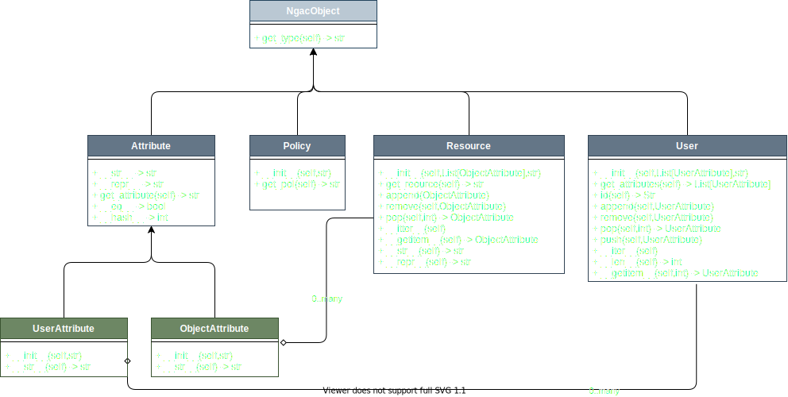

# Next Generation Access Control (NGAC)

This folder contains design documents for the Next Generation Access Control (NGAC) system wrapper.

## Class design for NGAC wrapper

### ngac_types

ngac_types defines a few different types, which are used to represent the different parts of the NGAC system.

- NgacObject is a superclass for all the other types used for type checking.
- attribute is a superclass for UserAttribute and ResourceAttribute. It is used for type checking.
- UserAttribute and ResourceAttribute are used to represent attributes of users and resources respectively.
- Policy is a pythonic representation of a policy in the NGAC system.
- Resource is a pythonic representation of a resource in the NGAC system.
- User is a pythonic representation of a user in the NGAC system.
